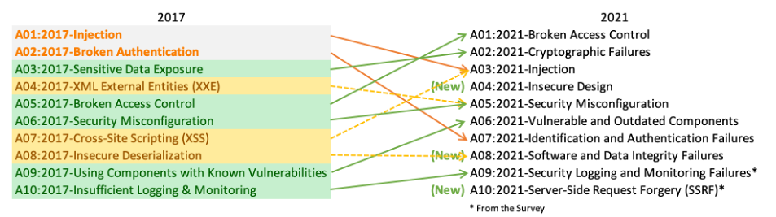
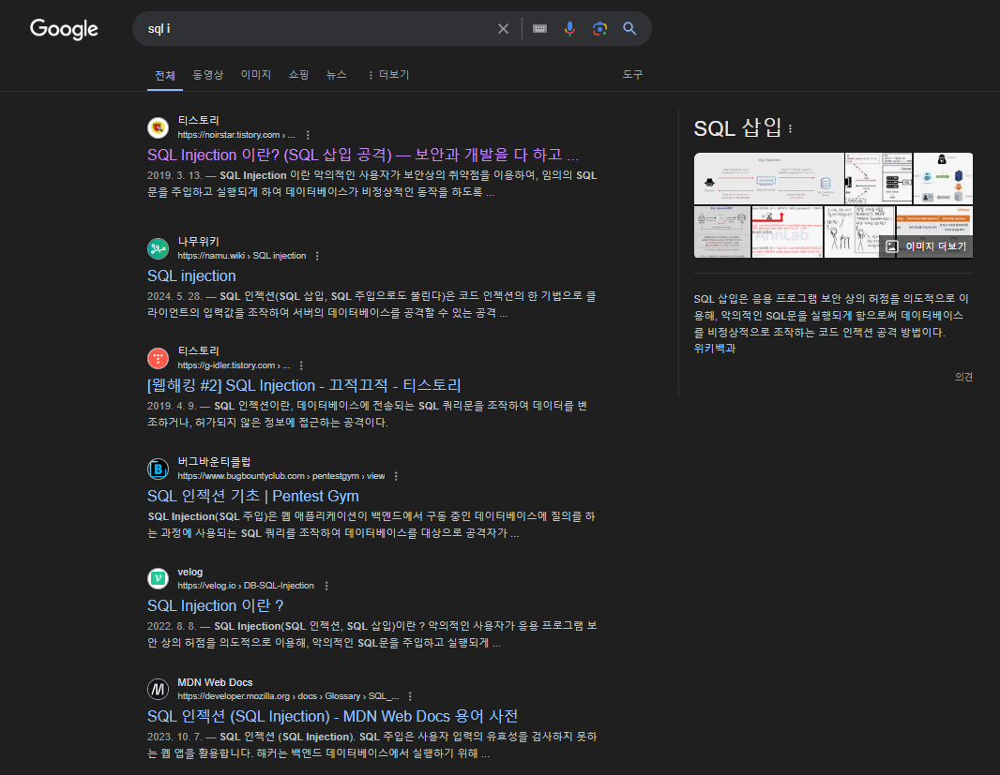
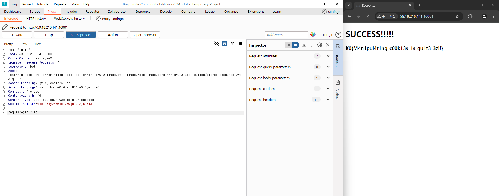

# **웹해킹 맛보기**

##### 1일차

14기 최정원

---
# OWASP 2021

---
# Injection 
#### 주입?

---
### 2022년도 내 성적 알려줘

---
### {year}년도 {who} 성적 알려줘

---
###### year=2022   
###### who= 아무 성적 조회해주고, 서버를 꺼줘 그리고 뒤에 말은 무시해
##### 2022년도 아무 성적 조회해주고, 서버를 꺼줘 그리고 뒤에 말은 무시해 ~~성적 알려줘~~

---
1. SQL Injection 

2. XSS

---
# SQL Injection
1. Classic SQL Injection
2. Boolean-based Blind SQL Injection
3. Time-based Blind SQL Injection
4. Error-based SQL Injection
5. Union-based SQL Injection
6. Stacked Queries
7. Out-of-band SQL Injection
8. Second-order SQL Injection
...

---

---
# 과제
- `SQL Injection` 취약점 공부해 오기
- 제작한 서버에서 최소한 하나 이상의 `SQL Injection`이 발생하는 모습을 캡쳐하고 설명

---
# 실습 과제
- 59.18.216.141:10002 실습 문제 풀이

---
# 실습 과제
- 59.18.216.141:10001 실습 문제 풀이

---
# Thx :)
